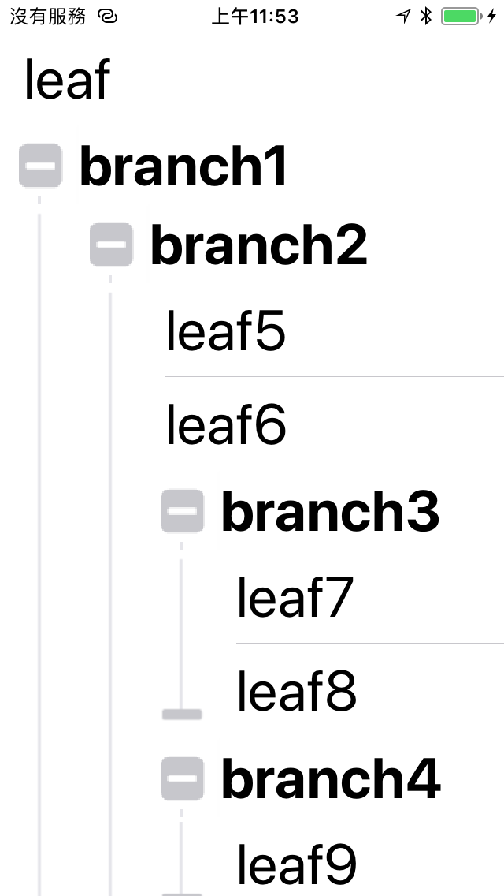

# IRHierarchyTreeTableView 

- IRHierarchyTreeTableView is a powerful tab view controller for iOS.

## Features
- Clear component of Hierarchy Tree.
- Fold and expand smoothly.
- Friendly UI.

## Install
### Git
- Git clone this project.
- Copy this project into your own project.
- Add the .xcodeproj into you  project and link it as embed framework.
#### Options
- You can remove the `ScreenShots` folder.

### Cocoapods
- Not support yet.

## Usage

### Basic

To use the tabbed page view controller, simply create a `UIViewController` that is a subclass of `IRTabbedPageViewController`. Then implement the following data source method:

```obj-c
    self.tableView = [[BranchTableIView alloc] init];
    self.tableView.delegate = self;
    
    Device *devicebranch1 = [[Device alloc] init];
    devicebranch1.name = @"branch1";
    Device *devicebranch2 = [[Device alloc] init];
    devicebranch2.name = @"branch2";
    Device *devicebranch3 = [[Device alloc] init];
    devicebranch3.name = @"branch3";
    Device *devicebranch4 = [[Device alloc] init];
    devicebranch4.name = @"branch4";
    Device *devicebranch5 = [[Device alloc] init];
    devicebranch5.name = @"branch5";
    Device *deviceleaf = [[Device alloc] init];
    deviceleaf.name = @"leaf";
    Device *deviceleaf2 = [[Device alloc] init];
    deviceleaf2.name = @"leaf2";
    Device *deviceleaf3 = [[Device alloc] init];
    deviceleaf3.name = @"leaf3";
    Device *deviceleaf4 = [[Device alloc] init];
    deviceleaf4.name = @"leaf4";
    Device *deviceleaf5 = [[Device alloc] init];
    deviceleaf5.name = @"leaf5";
    Device *deviceleaf6 = [[Device alloc] init];
    deviceleaf6.name = @"leaf6";
    Device *deviceleaf7 = [[Device alloc] init];
    deviceleaf7.name = @"leaf7";
    Device *deviceleaf8 = [[Device alloc] init];
    deviceleaf8.name = @"leaf8";
    Device *deviceleaf9 = [[Device alloc] init];
    deviceleaf9.name = @"leaf9";
    Device *deviceleaf10 = [[Device alloc] init];
    deviceleaf10.name = @"leaf10";
    Device *deviceleaf11 = [[Device alloc] init];
    deviceleaf11.name = @"leaf11";
    Device *deviceleaf12 = [[Device alloc] init];
    deviceleaf12.name = @"leaf12";
    
    branch = [[Branch alloc] initWithTableView:self.tableView];
    Branch *branch1 = [[Branch alloc] initWithDevice:devicebranch1];
    Branch *branch2 = [[Branch alloc] initWithDevice:devicebranch2];
    Branch *branch3 = [[Branch alloc] initWithDevice:devicebranch3];
    Branch *branch4 = [[Branch alloc] initWithDevice:devicebranch4];
    Branch *branch5 = [[Branch alloc] initWithDevice:devicebranch5];
    Leaf *leaf = [[Leaf alloc] initWithDevice:deviceleaf];
    Leaf *leaf2 = [[Leaf alloc] initWithDevice:deviceleaf2];
    Leaf *leaf3 = [[Leaf alloc] initWithDevice:deviceleaf3];
    Leaf *leaf4 = [[Leaf alloc] initWithDevice:deviceleaf4];
    Leaf *leaf5 = [[Leaf alloc] initWithDevice:deviceleaf5];
    Leaf *leaf6 = [[Leaf alloc] initWithDevice:deviceleaf6];
    Leaf *leaf7 = [[Leaf alloc] initWithDevice:deviceleaf7];
    Leaf *leaf8 = [[Leaf alloc] initWithDevice:deviceleaf8];
    Leaf *leaf9 = [[Leaf alloc] initWithDevice:deviceleaf9];
    Leaf *leaf10 = [[Leaf alloc] initWithDevice:deviceleaf10];
    Leaf *leaf11 = [[Leaf alloc] initWithDevice:deviceleaf11];
    Leaf *leaf12 = [[Leaf alloc] initWithDevice:deviceleaf12];
    
    FunctionModelBranchItem *branchItem = [[FunctionModelBranchItem alloc] initWithRowCount:1];
    [model addItem:branchItem];
    [branch add:leaf];
    [branch add:branch1];
    [branch add:leaf2];
    [branch1 add:branch2];
    [branch1 add:leaf3];
    [branch1 add:leaf4];
    [branch2 add:leaf5];
    [branch2 add:leaf6];
    [branch2 add:branch3];
    [branch3 add:leaf7];
    [branch3 add:leaf8];
    [branch2 add:branch4];
    [branch4 add:leaf9];
    [branch2 add:branch5];
    [branch5 add:leaf10];
    [branch5 add:leaf11];
    [branch5 add:leaf12];
    
    [self.view addSubview:self.tableView];
```

### Advanced settings

IRHierarchyTreeTableView can nice combine with another power tableview framework:IRHierarchyTreeTableView.


```obj-c
    self.tableView = [[BranchTableIView alloc] init];
    model = [[Model alloc] init];
    model.delegate = self;
    self.tableView.dataSource = model;
```
Called when the page view controller is scrolled by the user to a specific offset, similar to `scrollViewDidScroll`. The pageOffset maintains the current page position and a scroll direction is provided.

```obj-c
- (void)pageViewController:(IRPageViewController *)pageViewController
           didScrollToPage:(NSInteger)page;
```
Called when the page view controller completes a full scroll to a new page.

### Appearance
`IRTabBarView` provides properties for appearance customisation, including:
- `sizingStyle` - Whether the tab bar should size to fit or equally distribute its tabs.
- `tabStyle` - The styles to use for tabs:
    - `IRTabStyleText` for text.
    - `IRTabStyleImage` for images.
    - `IRTabStyleImageAndText` for images and text.
    - `IRTabStyleCustomView` for custom view.
- `indicatorStyle` - The style to use for the current tab indicator.
- `indicatorAttributes` - Appearance attributes for current tab indicator.
- `tabAttributes` - Appearance attributes for tabs.
- `selectedTabAttributes` - Appearance attributes for the selected tab.
- `selectionIndicatorTransitionStyle` - The transition style for the selection indicator.
 - `IRTabTransitionStyleProgressive` to progressively transition between tabs.
 - `IRTabTransitionStyleSnap` to snap between tabs during transitioning.
 - use `setTransitionStyle:` to set both the `selectionIndicatorTransitionStyle` and `tabTransitionStyle`.
- `tabTransitionStyle` - The transition style to use for the tabs.

#### Custom Tab Style
Set custom tab view in the `IRTabBarViewDataSource`.

```obj-c
#pragma mark - IRTabBarViewDataSource
- (void)tabBarView:(IRTabBarView *)tabBarView populateTab:(IRTabBarCollectionViewCell *)tab atIndex:(NSInteger)index {
    tab.customView = YOUR_CUSTOM_TAB_VIEW;
}
```

## Screenshots
  

## Copyright
##### This project is inspired from [MSSTabbedPageViewController](https://github.com/msaps/MSSTabbedPageViewController).
